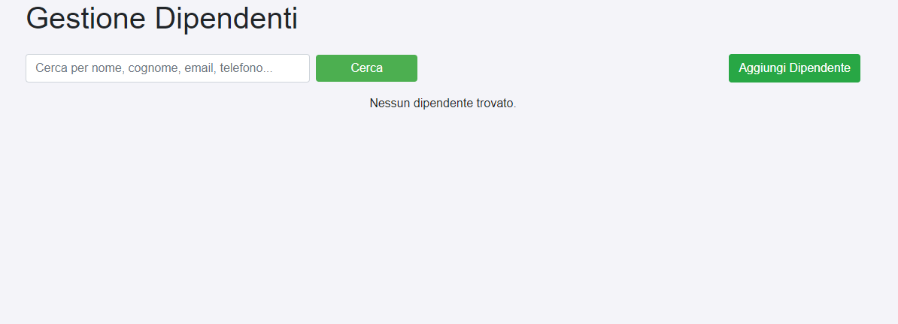
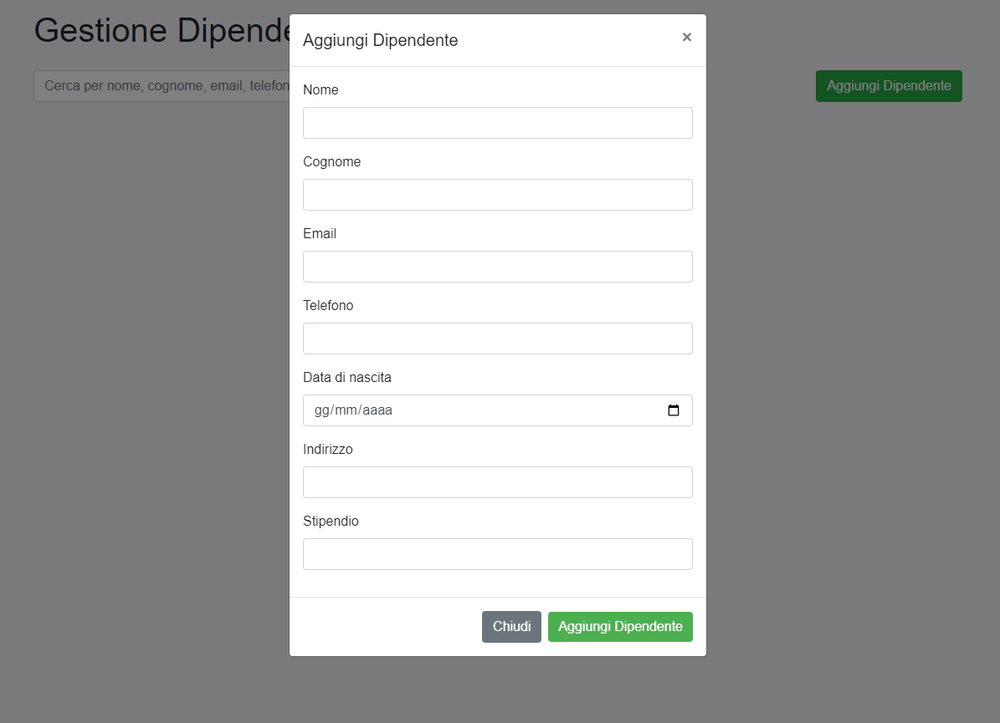
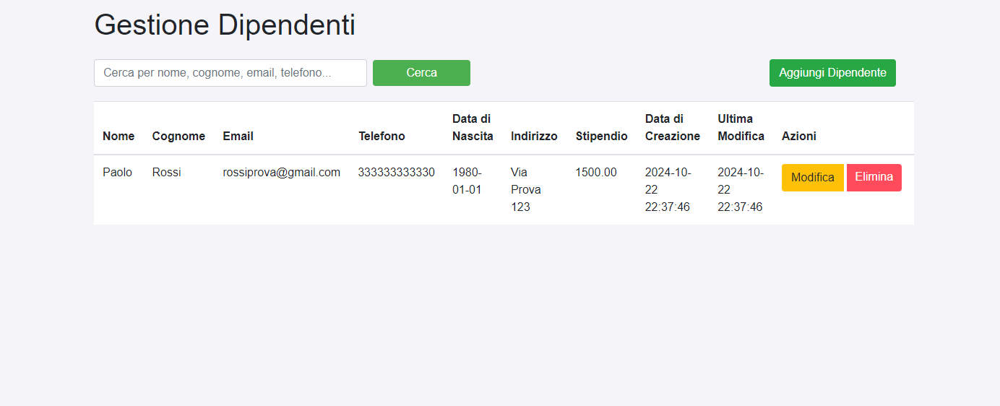
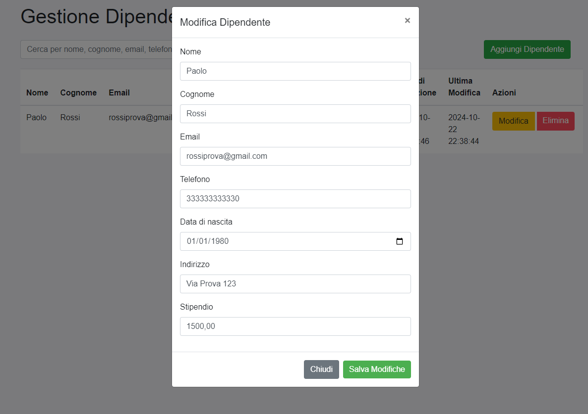
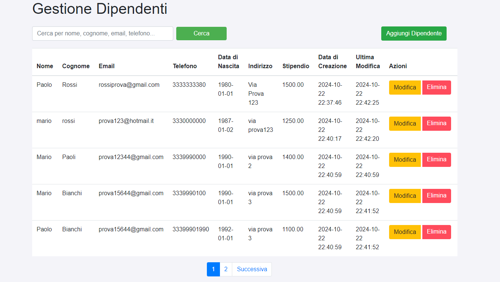

# Crud-Employees

Progetto di gestione CRUD (Create, Read, Update, Delete) per i dipendenti, realizzato in **PHP**.

## Screenshot






## Funzionalità
- Aggiungere, modificare, eliminare e cercare dipendenti.
- Validazione dei campi con gestione degli errori.
- Paginazione dei risultati.
- Gestione degli errori direttamente nelle modali.
- UI responsive e accattivante grazie a Bootstrap.

## Requisiti
- **PHP** >= 7.4
- **MySQL** per il database
- **Bootstrap 4.5** per lo stile front-end

## Istruzioni per l'installazione

1. **Clona il repository**:
   ```bash
   git clone https://github.com/amin1988dev/crud-employees.git

2. **Configura il database:**
    Crea un database MySQL chiamato crud_employees.
    Importa il file db.sql (se presente) nel tuo database per creare le tabelle.
    Aggiorna le credenziali di connessione nel file db.php

    ```bash
        $host = 'localhost';
        $db = 'crud_employees';
        $user = 'tuo-utente';
        $pass = 'tua-password';
    
Accedi a http://localhost:8000 nel browser.


## Struttura del Database

```sql
   CREATE DATABASE IF NOT EXISTS crud_employees;
   USE crud_employees;
   
   CREATE TABLE `employees` (
     `id` INT(11) NOT NULL AUTO_INCREMENT,
     `name` VARCHAR(255) NOT NULL,
     `surname` VARCHAR(255) NOT NULL,
     `email` VARCHAR(255) NOT NULL,
     `phone` VARCHAR(50) DEFAULT NULL,
     `birthdate` DATE DEFAULT NULL,
     `address` VARCHAR(255) DEFAULT NULL,
     `salary` DECIMAL(10, 2) DEFAULT NULL,
     `created_at` TIMESTAMP DEFAULT CURRENT_TIMESTAMP,
     `updated_at` TIMESTAMP DEFAULT CURRENT_TIMESTAMP ON UPDATE CURRENT_TIMESTAMP,
     PRIMARY KEY (`id`)
   ) ENGINE=InnoDB DEFAULT CHARSET=utf8mb4;

